# Lab 200: Creating an ATP integration


## Introduction

In order to send information to the ATP database, an integration will be created to receive data from a front end application, then query and write to the database.

**_To log issues_**, click here to go to the [github Oracle](https://github.com/oracle/learning-library/issues/new) repository issue submission form.

## Objectives

•	Create a REST endpoint that will receive a JSON payload. The integration then turns that into PL/SQL to query and insert data into the ATP database. The REST endpoint then returns the queried information.

## Data flow

The ZIP code from the VBCS application sent to a stored procedure. The stored procedure takes ZIP code and returns client name, market name, sales rep name, from market table where that ZIP code matches.

After this the returned client name and market name, along with the other fields sent in from the form, are written to the Opportunity table. This creates a record with the prospective client's details and relevant market. 

## Reference

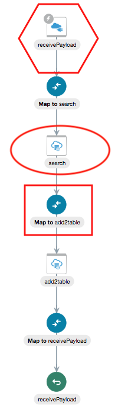

In the walkthrough, when you see REST adapter, it is referring to the icon in the red hexagon. The ATP connection is in the red circle and the mapping is in the red square. This is also how your integration will look at the end of the walkthrough.

During the walkthrough, relevant instructions will be UNDER the picture they correlate with.

# Walkthrough

### 1.	Create a connection with the ATP adapter

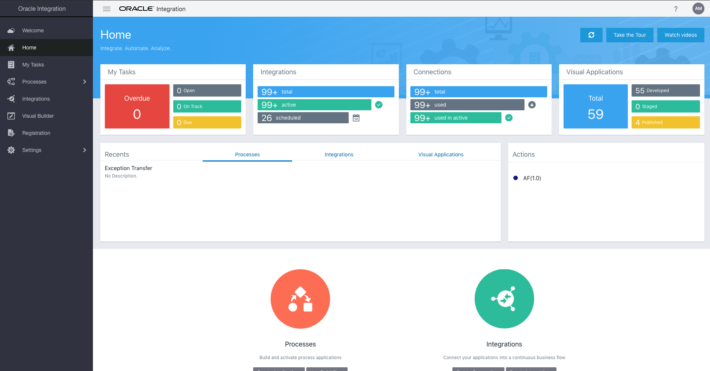

This is the OIC home page. Click Integrations on the left pane to get started. 

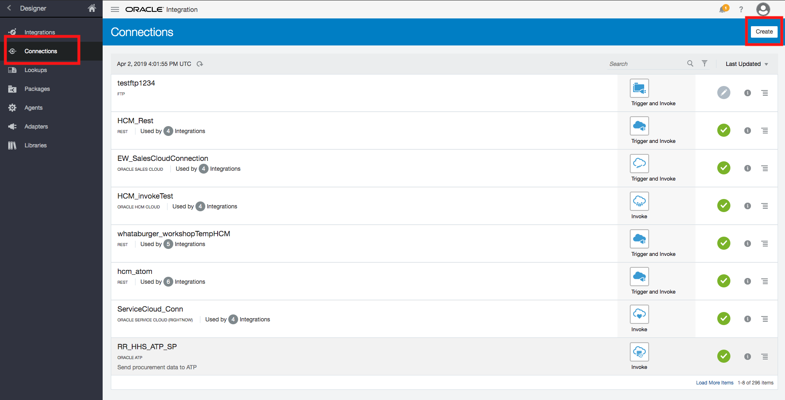

Now you are on the Integrations page. Click ‘Connections’ on the left pane to get to the above page. Then click the white box ‘Create’ in the top right.

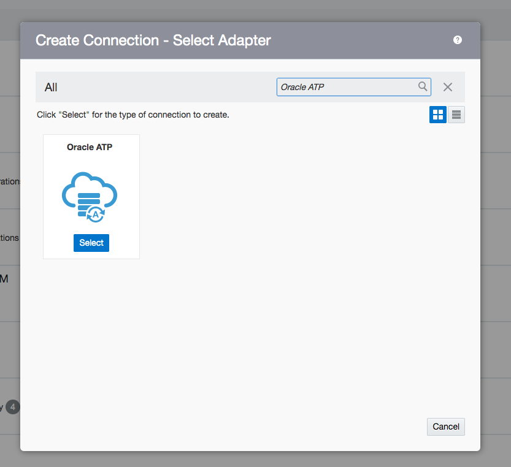

When the box comes up, type ‘ATP’ in the search box. This adapter will come up, press select. 

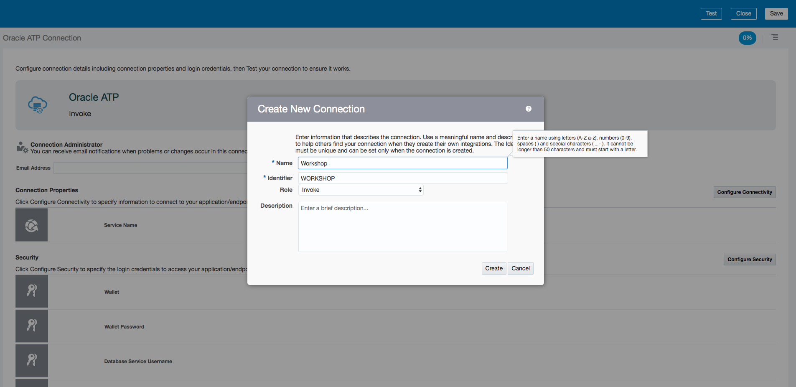

Name your adapter ‘WorkshopXX’, with the XX being your initials.

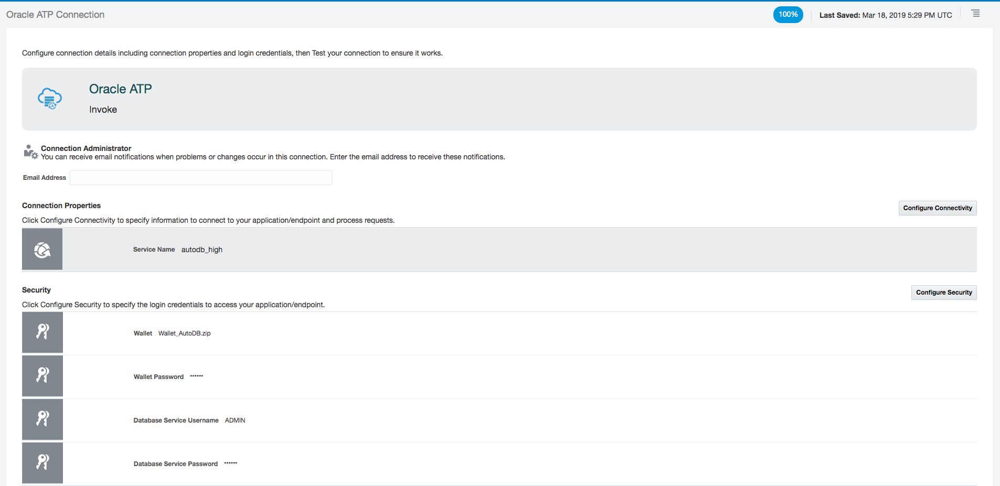

On this screen, configure your connection details like this. Your instructors will be able to provide you with exact names and password. 

### 2.	Create the integration


After saving your connection, click integrations on the top of the left pane. Then click create on the top right, select ‘App driven orchestration.’

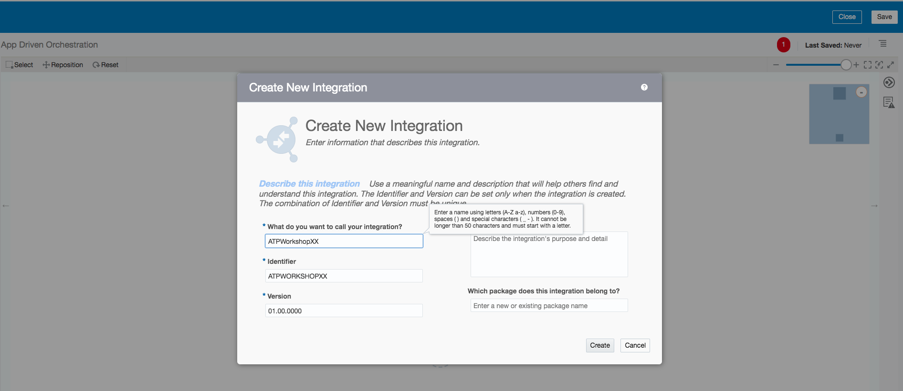

Name your integration, ‘ATPWorkshopXX’ with XX being your initials. 

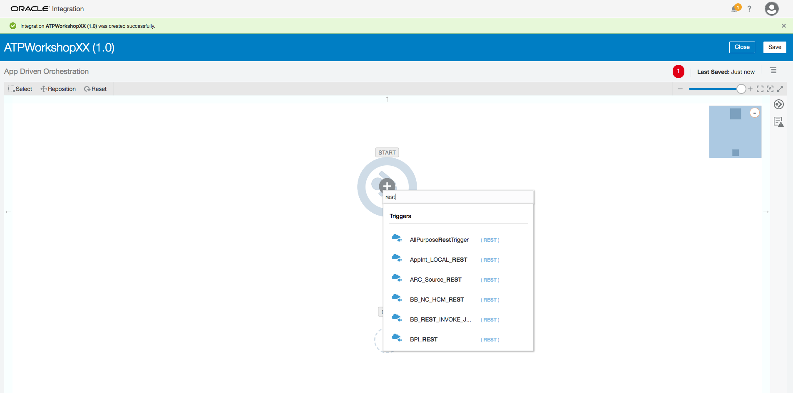

To start your integration, you will need to drag and drop a REST adapter that will receive the JSON payload sent from the VBCS application. Your instructors will tell you the exact name.

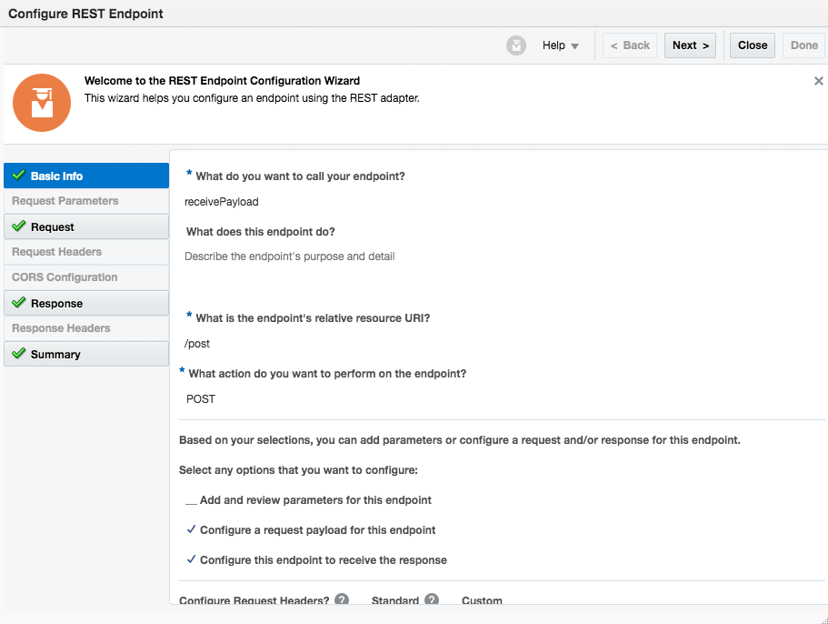

For configuring the adapter, you can name your endpoint and the relative resource URI what you would like, though /post is recommended for the URI. Do not forget the relative resource URI if you change it – you will need it in Lab 300, make it /post to save work later. On the screen, make sure you select configure a request payload and configure this endpoint to receive the response. 

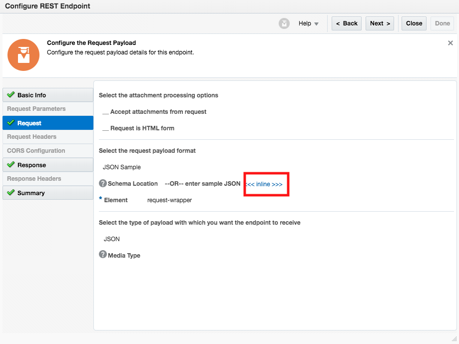

On the request and response screens tabs, click <<< inline >>> to enter the JSON payloads this adapter will receive and return. Copy and paste the values below. There are two different screens, one for request, and one for response.

Request: (only copy below this)

```
{"city": "", "state": "", "addressNum": "", "addressStreet": "", "zipcode": "",  "country":"",  "region": ""}

```
The information you paste should look like this. 

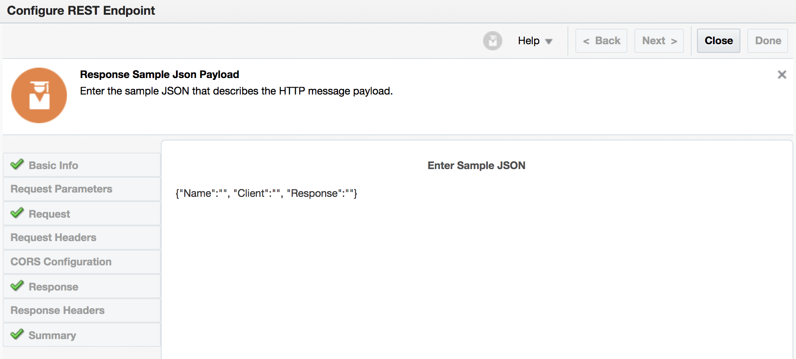

Response: (only copy below this)

```
{"Name":"", "Client":"", "Response":""}

```
(only copy above this, should appear like in the screenshot)

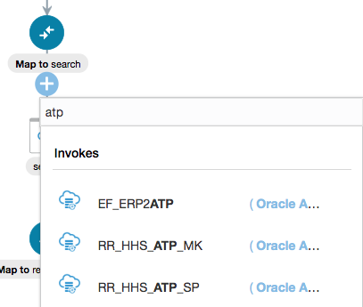

After configuring the REST adapter, click the + sign that appears on the line below. Here, select your ATP connection. If you cannot find your ATP connection, click the area of the screen in the red box in the picture below. Click Oracle ATP, and then drag and drop your connection below the REST adapter.


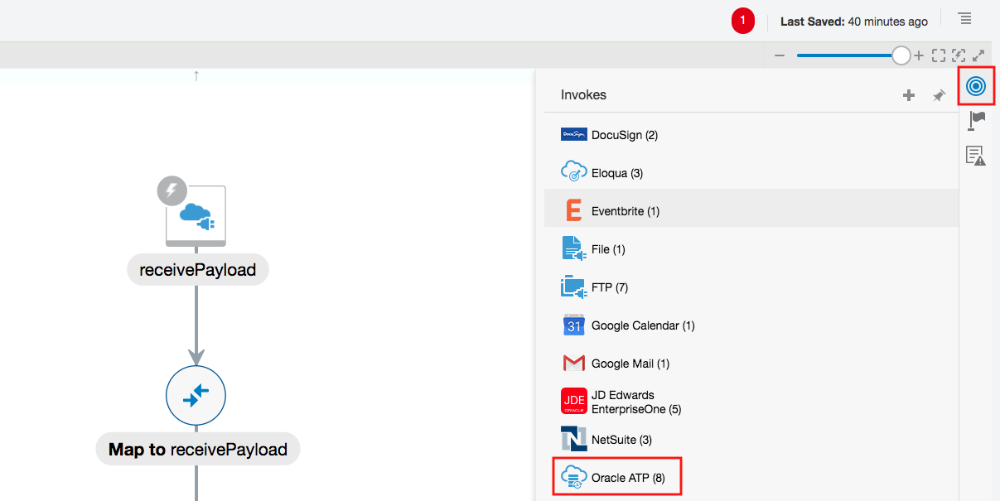 

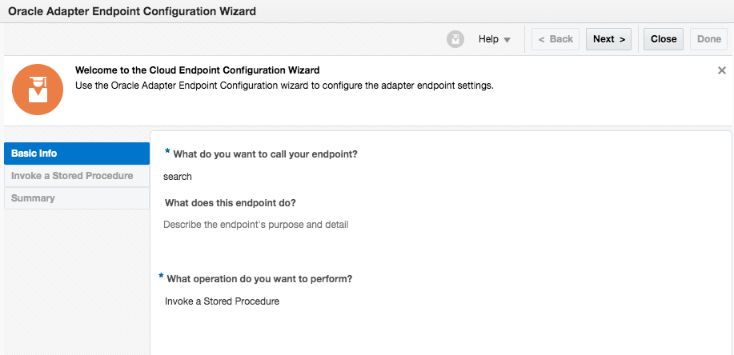

You can call the endpoint what you want, but for the operation – select invoke a stored procedure. Then press next.

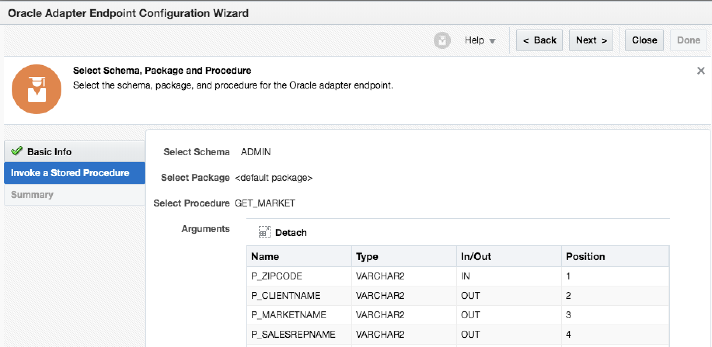

On this screen, select ADMIN as the schema and then select GET_MARKET. You should see these values on your screen. You may have to scroll down to see them. Hit Next, then Done to complete configuring the ATP adapter


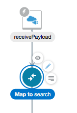

Between your REST adapter and ATP adapter, hover over the new Map to search icon, click it, and then press the pencil icon. The mapping will dictate how data flows from your REST adapter to your ATP.

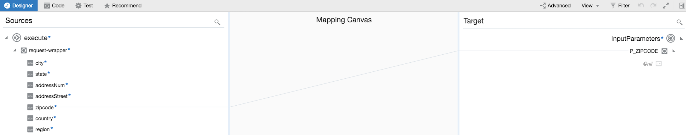

This screen will come up, drag and drop 'zipcode' from the left to P_ZIPCODE on the right. This send the ZIP code from the JSON payload as the input for the stored procedure on the ATP database. Then press validate and close on the top right.

After this place another ATP connection below your first ATP connection. Go back to the top right where you found your connection and drag and drop it below your first ATP adapter.

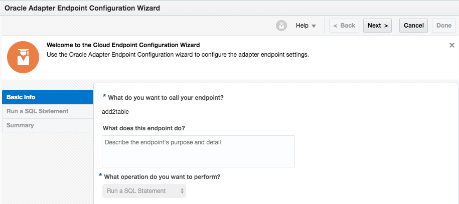

On this screen, name your endpoint add2table and select the ‘Run a SQL Statement’ operation. 


Copy and paste this into the SQL Query box:

```
INSERT INTO Opportunity(client, name, region, country, state, city, address, zipcode, timeEntered) VALUES (#client, #name, #region, #country, #state, #city, #address, #zipcode, #timeEntered)
```
Then press validate SQL Query. When the integration is finished, this is going to perform this SQL query pasted on the Client name returned from invoking the stored procedure. 

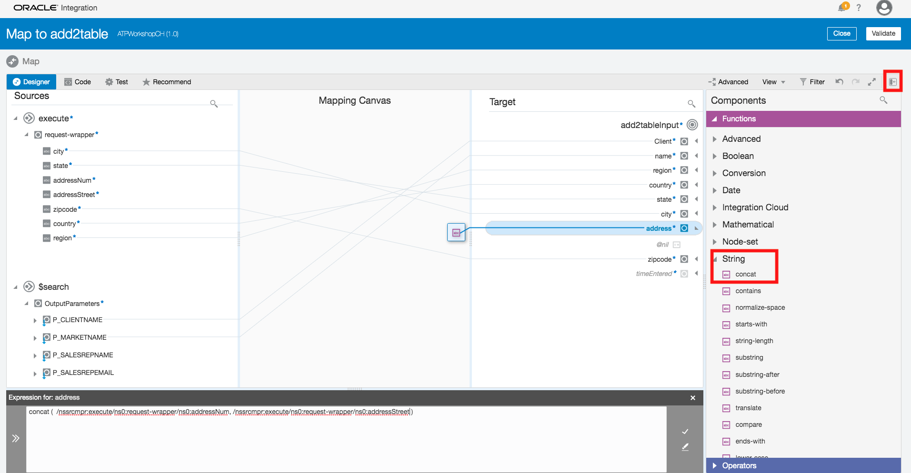
The above and below screenshots are for the next mapping.
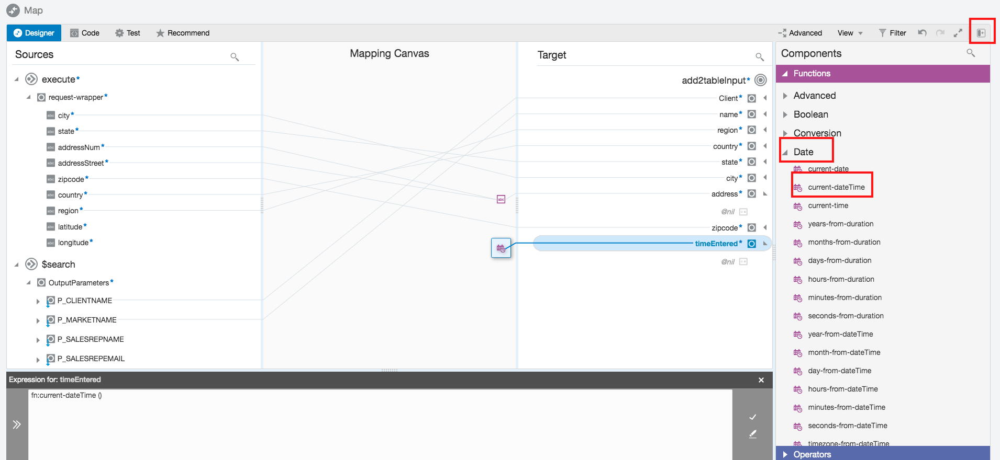

Now another mapping called 'Map to add2table' should appear below your first ATP adapter. This dictates how data flows to the SQL statement being performed on ATP. Click the mapping and click the pencil again.

Drag and drop the fields from the left to the right. For the fields without lines from left to right - the ones with the purple symbols on the right, configure them with the expressions in these screenshots. You can bring up these expressions by clicking on the button in red. To configure them with those expressions, click the button in the red box to get the functions. The concat function is in the 'String' section. The use the concat function, open the expression box for address by clicking it, then drag and drop concat into it, 'concat (,)' should appear. While your cursor is in a location, drag and drop the relevant fields into the expression. Like so:

concat([addressNum], [addressStreet])

The brackets stand for the fields on the left.

 The time function is in the date section.

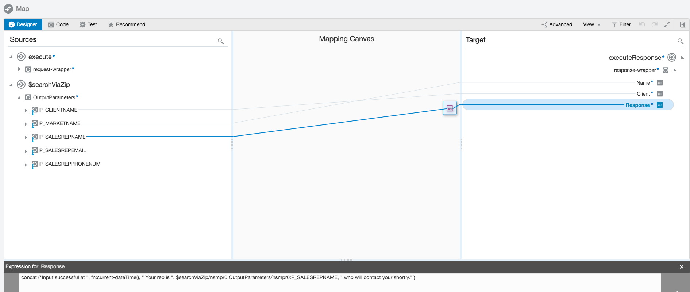

Now go to the 'Map to receivePayload' (or whatever you named your REST adapter) mapping. And configure it as per the above screenshot. You will need to use the concat function accessed with the button on the upper right, just like the a couple pictures above.  For mapping the salesrepname, drag and drop it from the left to the expression box below. This is the data that is sent back to the VBCS application. Validate and close.

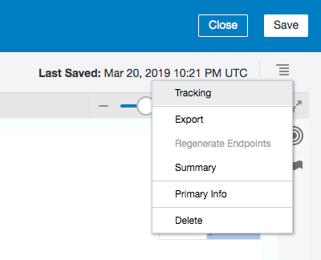

Lastly, go to the top right of the integration screen and press the 4 horizontal lines. Press tracking. 


Drag and drop ZIP code from the left to one of the tracking fields, then press save. This will be used for tracking your individual integrations later in the lab and potentially, for troubleshooting. After this save and close your integration on the top right. 

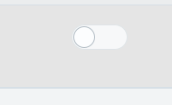

Back on the integrations screen, press this button on the same row as your integration. This will activate it. 

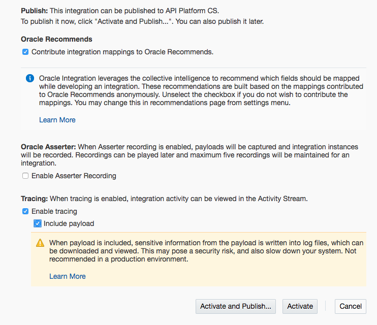

On this popup, select enable tracing and include payload, then press activate. 

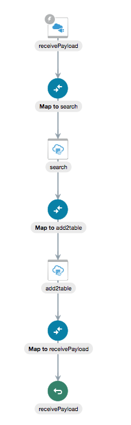

After all these steps, your integration should look like this. The order may be different.

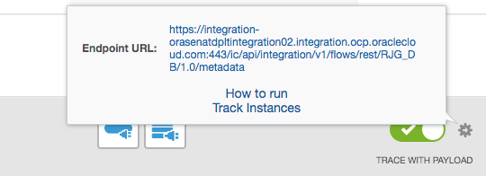

After the integration is active, click the grey arrow to the right of the green activation button. Copy and paste this endpoint in your browser. This new window will have the endpoint you use to call this integration. 

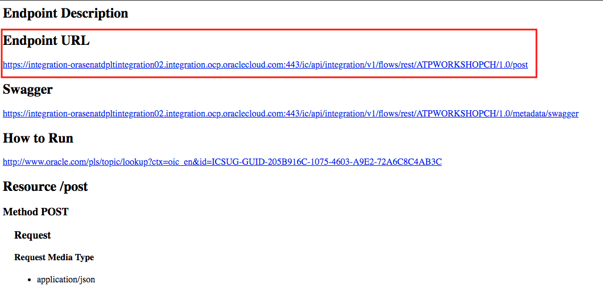

After pasting the the URL from the previous screenshot and navigating to this page, copy the URL in the red box from this screen. You will need this URL in Lab300.


