# Lab 300: Connecting your integration to an application

This lab details how to configure the the integration with a front end VBCS web application.

## Introduction

This lab configures the front end application that will send information to the ATP database and will then receive queried information back from the database.

## Prerequisites

- Completion of Lab 200.

## Walkthrough

Back from the OIC homepage, click on Visual Builder on the left pane. 

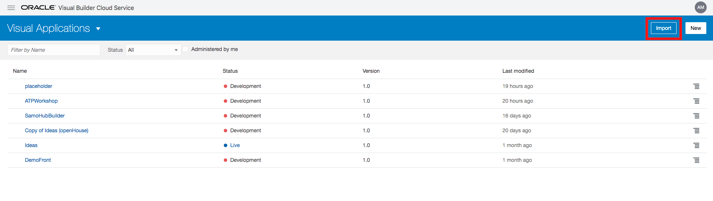

On this screen, click import on the top right and use the file given to you by your instructors. Select import from file, your instructors will provide you with this. Name your application ATPWorkshopXX, with XX being your initials. Type the same for Application ID. And then click import. Then click the name of your application in blue. 

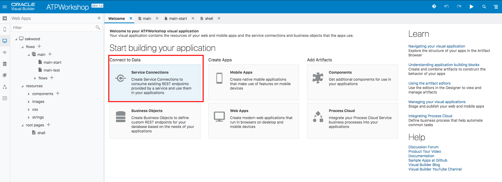

This is the home screen of your imported app first we have to configure the app to connect to your integration’s endpoint. To do this, click service connections and then the service connection that appears on the left. 

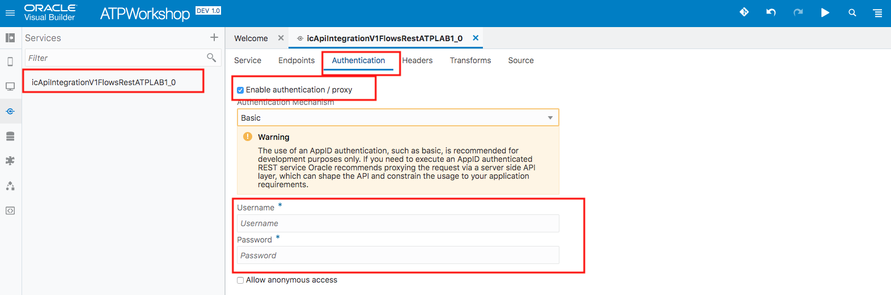
The service connection will then appear on the left (in the red box). Click that. Click the authentication tab, check mark the "enable authentication/proxy" box, and select basic; your instructor should provide you with the username and password. After this, click the service tab.

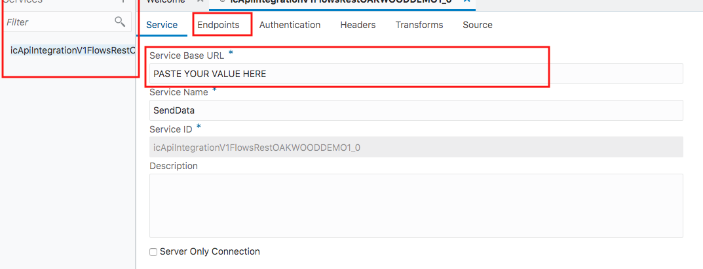

On this screen change the base url to what you copied from your integration, but remove the /metadata at the end. After this, click on endpoints. Note: you may also need to click on authentication, to the right of endpoints and change the data per what your instructors say. 

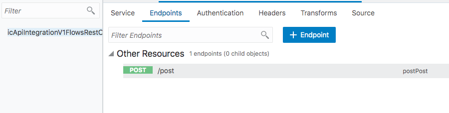

Now click on /post

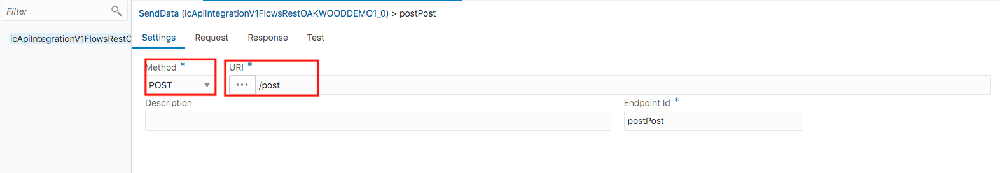

Change the /post here to what you specified as the URI when you made your REST adapter at the beginning of lab 200. If you used post, then you don’t need to change anything.

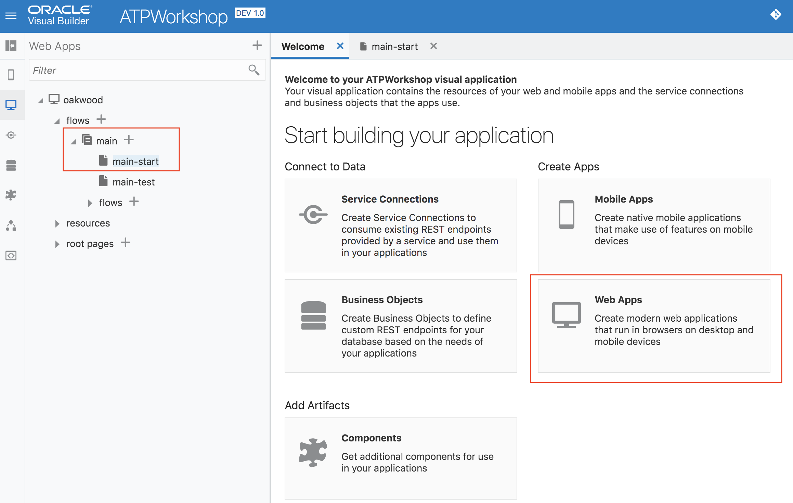
Back on the welcome screen, press web apps. Then on the left, click the drop down arrow next to main, then press main start. You will then see the screen below. 

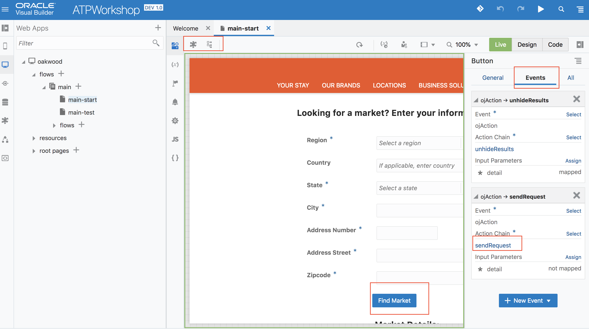

First, click the two buttons in the upper left red box to see more of the screen. Then click the blue find market button, the box on the right will appear. Click events on the top and then sendRequest in the red box.

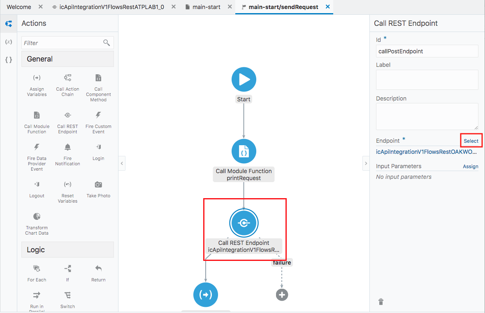

This screen will then appear, first click the Call REST Endpoint button. You need to configure this to call the REST endpoint you created in lab200. Then click the select button on the right 
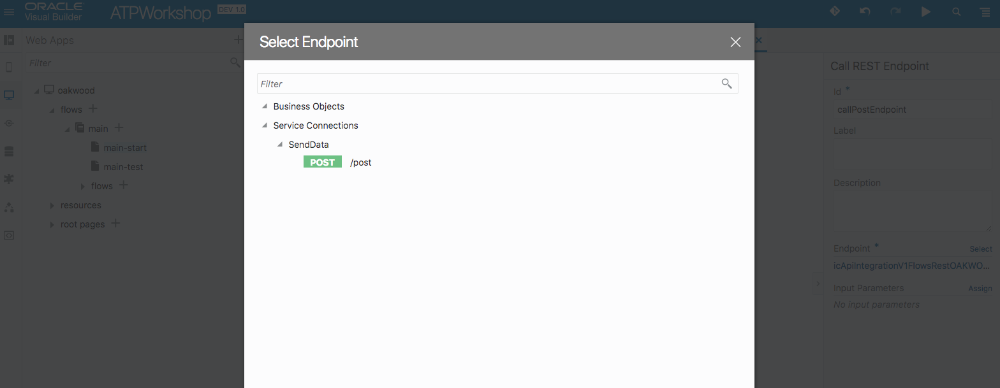

This screen will then come up, click the small arrow to the left of Service Connections. Then click the second small arrow until you see the green post box. Click the green post box and then click on select on the bottom right of this window. 

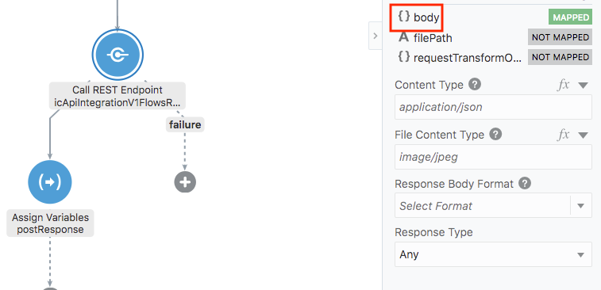

Now click on 'body' in the red box. 

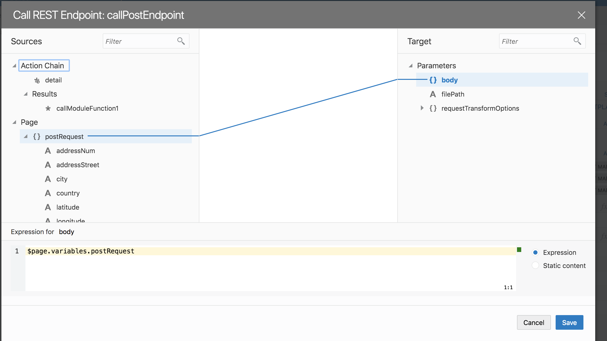

This screen will come up, drag and drop postRequest from the left to body on the right. This is ensuring the fields from your form are submitted as a JSON payload to your integration endpoint. Click save on the bottom right when you're done.

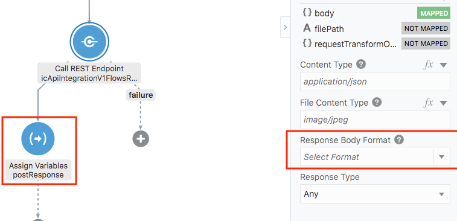

Back on this screen, you must ensure that Response body format says 'select format.' After this, click assign variables and then the body that appear for it, you need to do one more mapping operation.

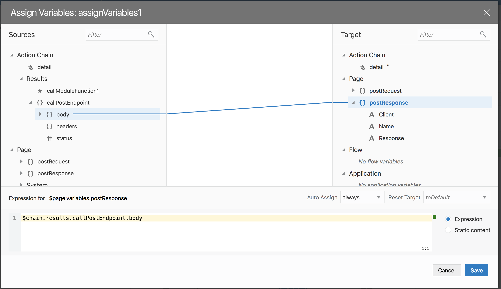

Drag and drop the body of the callPostEndpoint from the left to the postResponse on the right. You do not need to drag the individual fields. After this click save. 

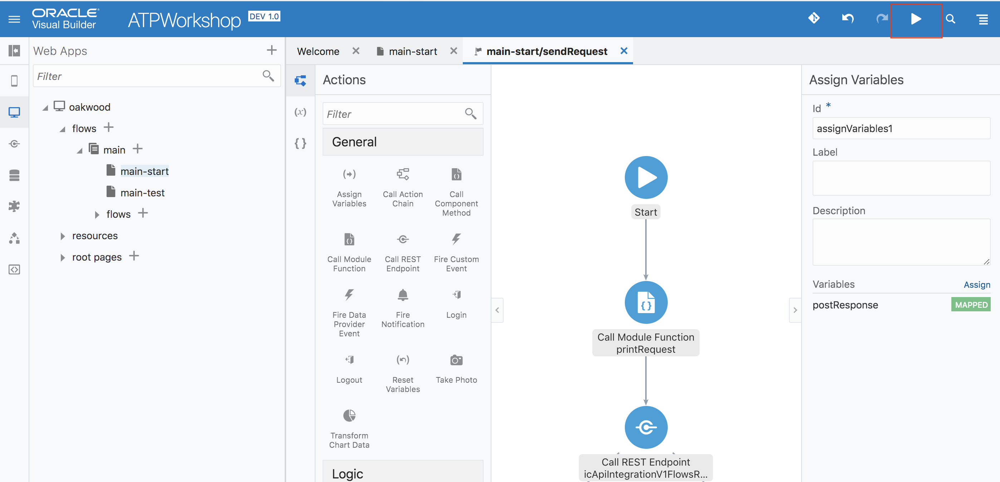

Now, your application is fully configured and you can submit info to the database and query it. To do so, press the play button on the top right. 

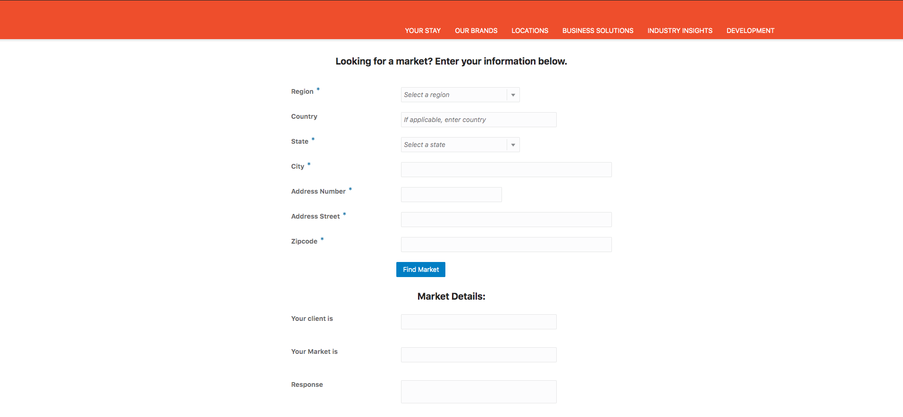

This is the user interface for the application. You can input your information, just make sure the zipcode is ‘12345.’ 

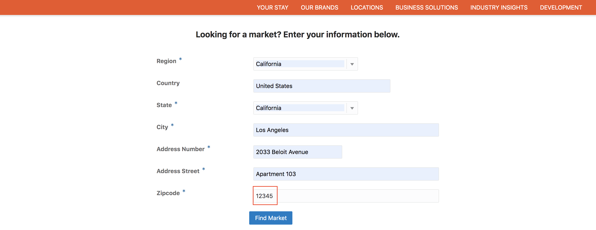

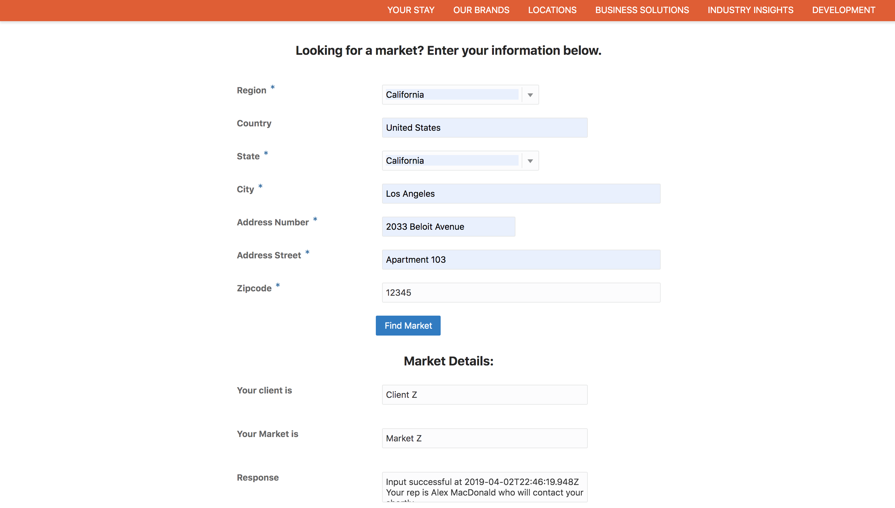

After inputting your information and pressing ‘Find Market’ you will have this information returned to you. The responses are based on how you mapped them in lab 200. 

Congratulations! You have completed this lab on OIC and ATP. 