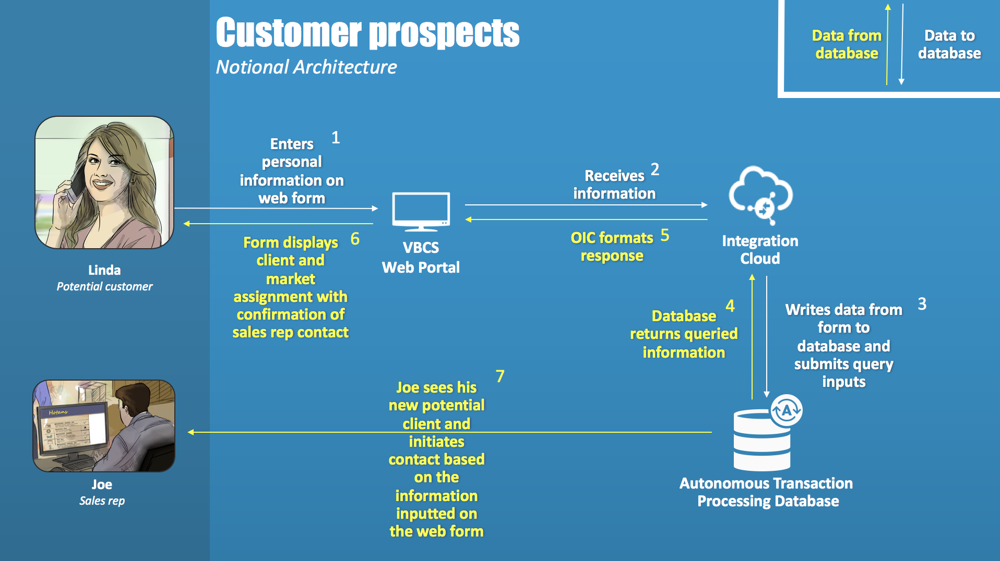
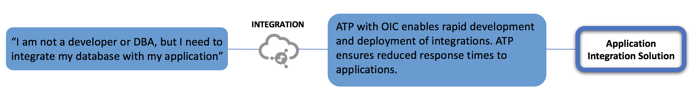

# Workshop: Connecting Autonomous Transaction Processing with OIC

## Introduction

This lab will teach you how to make an integration with Oracle’s ATP database, using the Oracle Integration Cloud, OIC. The integration will allow a web page to query information in the ATP database and write new information to a table.

## Use case 

A prospective customer is entering his or her information on the company website (VBCS app), then the website returns to the customer their assigned market and client status. Lastly, the integration takes the customer’s information and the sales rep’s info and puts that in a separate table in the database as a way of managing which sales reps are assigned to which customers. 

### Pain and Gain

## Prequisites
	1. OIC instance 
	2. ATP instance
		- with a Cloud Wallet
	3. Visual Builder Cloud Service, VBCS, app 
      - the file to import is in the folder with this lab, it is a zip file called "ATPWorkshop.zip"
	4. Generic REST adapter
	5. SQL Developer

If your instructors have not procured the above items for you, please follow the steps in Lab 100. 

